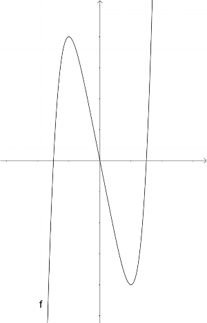
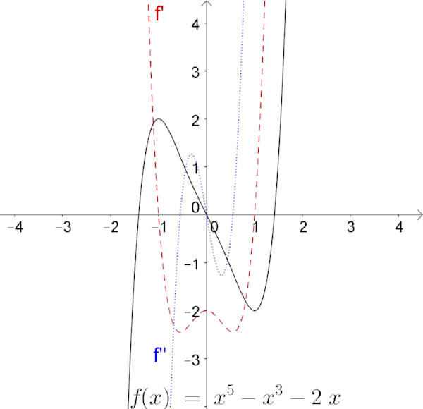

# Calc 1 Questions on Extrema and Inflection Points
A few years ago, my exam questions over extrema and/or inflection points read
in a way similar to the following.

> For the function `\(f(x) \unicode[STIXGeneral]{x2254} x^{5} - 5 x\)`,
> find all extrema and all inflection points, as well as intervals of
> monotonicity and intervals of concavity.

But now, I include a graph of the function with the exam questions.

Notice how there are no tick marks on the axes. This prevents guessing the 
answers when the answers are at integer points. Here are my thoughts, as well 
as some of my colleagues thoughts, on this change.

### Advantages of Including the Graph
I include graphs because I feel that students get lost in putting the critical 
points on a number line and testing the intervals in between. Admittedly, while 
this is not a difficult task, I think that students are deterred by its tedium. 
Whereas looking at a graph, be it plotted on a graphing calculator or given
with the question, a student can immediately determine where the function is 
increasing or decreasing and concave up or concave down, once they know where 
the critical points and potential inflection points. My hope is that this will 
improve student understanding by omitting unnecessary tedium and focusing on
more important concepts.

I can now use a graphing utility when going over such examples without
pressuring students to go out an buy a graphing calculator. And I get extra
class time by not having to testing for the sign of derivatives.

### Disadvantages of Including the Graph and Mitigation

There are functions like
`\(f(x) \unicode[STIXGeneral]{x2254} x^{5} - x^{3} - 2 x\)` whose graph does
not clearly show concavity. I can avoid such functions on exams without loosing 
assessment value. And for homework and in class, graphing the first and second 
derivatives will clear up any confusion.

I asked colleagues if they could find any more flaws in this idea. The only 
suggestion was that students might have a weaker association between a positive 
first derivative and an increasing function, etc. This problem might be averted 
by using the extra class time to address exercises like the following.

* Given the graph of `\(f(x)\)`, sketch `\(f'(x)\)`  and `\(f''(x)\)`  on the
same graph.
* Given the graph of `\(f'(x)\)`, sketch `\(f(x)\)` on the same graph.
* Given the graph of `\(f''(x)\)`, sketch `\(f'(x)\)`  and `\(f(x)\)`  on the
same graph.

I would predict that this mitigation would help students build a related, but 
distinct connection between the sign of the first derivative and monotonicity.

## Your Thoughts

Would you predict the same things that I and/or some of my colleagues have?

1. Students get bogged down when testing the sign of derivatives and hence lose 
understanding of the broader principles.
1. The only disadvantage to including graphs with extrema and/or inflection 
point questions is a weaker association between the sign of the first 
derivative and monotonicity as well as sign of the second derivative and 
concavity.
1. This disadvantage can be mitigated by having students sketch graphs of 
derivatives from the graph of a function and vice versa.

<!--
spell-checker:ignore STIX 
-->

